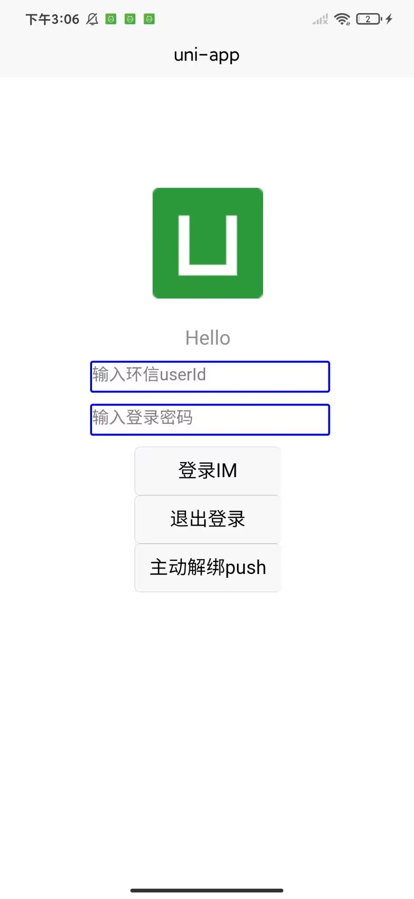
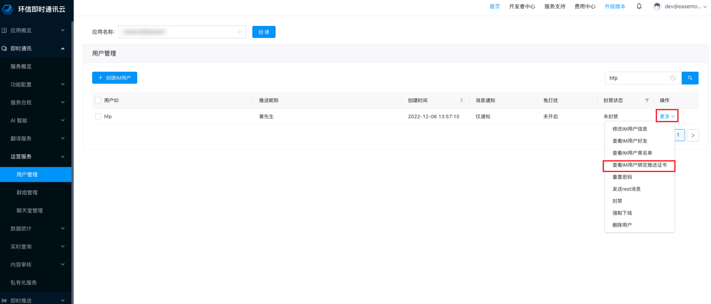
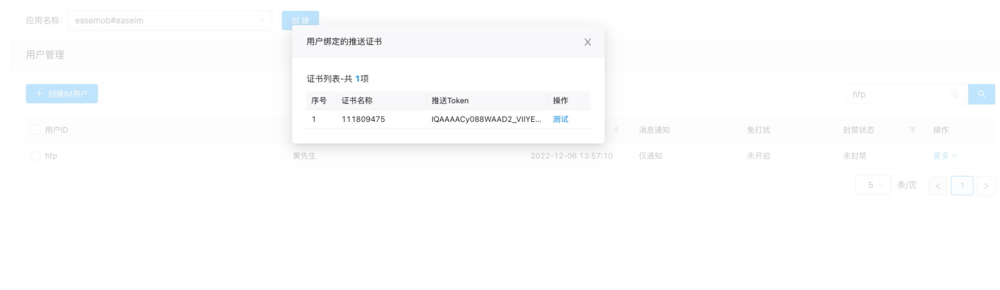
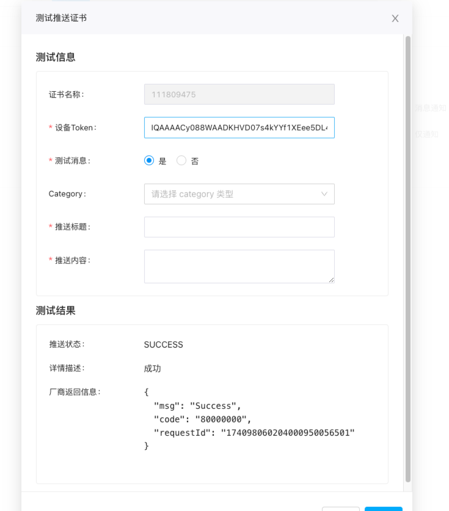

# 环信 uniApp 推送演示项目

基于 uniApp 的跨平台即时通讯消息推送解决方案，集成环信 SDK 实现多端推送功能。

## 特性亮点

- 📱 平台支持（iOS/Android）
- 🔔 原生级推送通知支持（华为/小米/vivo/oppo/荣耀/魅族/APNs）
- 💬 即时通讯与推送服务深度整合
- 🔒 离线消息保障机制
- 📦 开箱即用的推送配置模板

## 技术栈

- 前端框架：uniApp (Vue3)
- 推送服务：环信 IM SDK 4.9.1+
- 依赖插件：[原生推送插件（android/iOS）](./nativeplugins/EMPushUniPlugin/)
- 开发工具：HBuilder X

## 项目核心结构

- `nativeplugins`：原生插件目录
  - `EMPushUniPlugin`：原生推送插件
- `manifest.json`：项目配置文件
- `pages.json`：页面配置文件
- `static`：静态资源目录
- `uni_modules`：uniApp 插件目录
- `pages` ：页面目录
  - `index`：首页目录
    - `index.vue`：示例调用代码
- `utils`：工具函数目录
  - `WebIM.js`：环信 IM SDK 初始化代码
  - `pushHelper.js`：推送助手，统一管理在线/离线推送
- `App.vue`：应用入口组件
- `main.js`：应用入口文件

## 快速开始

- 具体使用建议直接参考环信官方文档，本项目仅作为演示使用。

  [文档入口](https://doc.easemob.com/document/applet/push/uniapp_push.html)

  ## 效果验证

  - 以下步骤以华为平台为例

  1. 环信管理后台上传在华为平台申请的证书，[参考文档](https://doc.easemob.com/document/android/push/push_huawei.html),可查看步骤一、步骤二。
  2. 生成`agconnect-services.json`文件，放置在`nativeplugins/EMPushUniPlugin/android/assets`目录下。

  3. 配置环信 IM SDK 相关信息，主要为在`utils/WebIM.js`文件中配置`appkey`。
  4. 运行项目，在自定义基座或真机进行调试方可生效。
  5. 在运行后的页面输入，userId，userPwd，点击登录按钮,登录后 SDK 内部自动进行 token 证书上传以及推送证书绑定。
     如图所示：
     
  6. 登录环信 console 管理后台，在`即时通讯/运营服务/用户管理`一栏，搜索登录用户，并点击更多，查看绑定推送证书，如图所示：
     
  7. 如绑定成功预期会如下图所示：
      8.下一步可直接在管理后台测试推送功能，首先杀死应用，然后点击测试按钮，输入一系列参数，点击测试按钮，如图所示：
     
  8. 预期效果如下面视频所示。

  - 华为推送演示视频
    <video src="./static/demo/8357919dcd93e8fad502fba9020eb12e.mov" controls="controls" width="100%"></video>

## 华为推送限额与 Category 分类说明

华为 Push Kit（含 HarmonyOS 4.0）对 **Category 不是 IM** 的消息，限制取决于该消息最终被归入哪一大类。核心规则如下：

### 1. 分类决定限额

华为将通知消息分为两大类进行管控：

| 消息大类 | 典型 Category | 单设备每日接收限制 |
|---|---|---|
| **服务与通讯类** | `IM`（即时聊天）、通话、服务提醒、订阅、订单物流等 | **无单独条数上限** |
| **资讯营销类** | 内容推荐、新闻、产品促销、运营活动等 | **新闻类应用 5 条，其他应用 2 条** |

### 2. 关键结论：非 IM 的 Category 限制分两种情况

- **若 Category 属于「服务与通讯」中的非 IM 子类**（例如服务提醒、订阅、出行、订单等），**不占用营销限额**，每日单设备接收没有单独条数限制，但仍受华为系统级频控及 **单设备单应用每日 3000 条** 的硬上限约束。
- **若 Category 未传、传错，或属于资讯营销类**，则会被归入资讯营销消息，受应用类别限制：**普通应用 2 条/天，新闻类应用 5 条/天**。

### 3. 自分类权益是前提

只有申请了 **自分类权益** 并在推送时正确携带 `category` 字段，华为才会信任开发者的分类，按服务与通讯类放行。  
若未申请自分类权益，或申请后未传 `category`，消息**默认全部按资讯营销类处理**，直接触发 2 条/天（或 5 条/天）的限额。

### 4. 其他硬性边界

- **单设备单应用每日总上限**：无论类别，向同一设备同一应用推送超过 **3000 条** 后会被限流丢弃，24 小时后恢复。
- **测试消息**：设置 `target_user_type = 1` 时，每个应用每日可发 500 条测试消息，且不受上述每日推送数量上限限制。

> **一句话总结**：
> Category 不是 IM 但属于服务与通讯类（如服务提醒）→ 不受营销限额限制；
> Category 不是 IM 且被系统判定为资讯营销类 → **普通应用 2 条/设备/天，新闻类应用 5 条/设备/天**。
>
> **在环信管理后台测试华为推送时，如果本来可以收到，后来离线收不到了，请检查一下 Category 的填写是否正确，以及证书是否具备自分类权益。**

---

> 📢 **厂商通道推送限制与解决方案（全平台）**
>
> 除华为外，小米、OPPO、vivo、荣耀、魅族等厂商通道均有各自的推送限额、分类管控及 QPS 限制。环信官方文档已汇总各厂商的通道限制说明与对应的解决方案，强烈建议在集成前完整阅读：
>
> 👉 **[Android 厂商通道限制及解决方案](https://doc.easemob.com/value-added/push/push_androidchannel_restriction.html)**

## 推送技术架构

本项目采用**双轨推送架构**，分别处理应用在线状态和离线状态的推送场景：

### 在线推送（应用在前台/后台运行）

当应用处于在线状态时，使用 **uniApp 系统通知栏 API** 实现本地通知推送：

| 特性 | 说明 |
|------|------|
| 触发时机 | 应用运行中收到新消息 |
| 技术方案 | 调用 `uni.createPushMessage()` 或 `plus.push.createMessage()` |
| 优势 | 即时响应、无需服务器、可自定义通知样式 |
| 适用平台 | iOS / Android |

**在线推送代码示例：**

```javascript
// 在环信消息监听中处理在线推送
EMClient.addEventHandler("messageHandler", {
  onTextMessage: (message) => {
    // #ifdef APP-PLUS
    // 应用在前台时显示本地通知
    plus.push.createMessage(message.msg, message.from, {
      title: "新消息",
      icon: "static/logo.png",
      sound: "system",
      cover: false, // 不覆盖上一次通知
      when: new Date(),
    });
    // #endif
  },
});
```

### 离线推送（应用被杀死/未运行）

当应用被杀死或处于未运行状态时，使用 **厂商推送通道** 直接推送至系统通知栏：

| 特性 | 说明 |
|------|------|
| 触发时机 | 应用未运行时收到新消息 |
| 技术方案 | 厂商服务器 → 系统通知栏（系统级通道） |
| 插件作用 | EMPushUniPlugin 仅负责 Token 获取与绑定 |
| 消息展示 | 系统直接展示，应用层不参与解析 |
| 支持厂商 | 华为、小米、OPPO、VIVO、荣耀、魅族、APNs(iOS) |
| 优势 | 应用未启动也能收到推送、系统级通道保障送达 |

**离线推送数据流向：**

```
┌─────────────┐     ┌─────────────┐     ┌─────────────────┐     ┌──────────────┐
│   发送方    │────▶│  环信服务器  │────▶│   厂商推送平台   │────▶│  接收方设备   │
│  (App/Web)  │     │  (IM服务)   │     │ (华为/小米/OPPO) │     │ (系统通知栏) │
└─────────────┘     └─────────────┘     └─────────────────┘     └──────────────┘
                                              ↑                        ↑
                                              │                        │
                                       证书绑定配置              系统直接展示
                                       (manifest.json)            (无需应用解析)
```

> **注意**：EMPushUniPlugin 插件仅负责**获取推送 Token 并绑定到环信服务器**，离线推送的消息内容由**厂商服务器直接推送至系统通知栏**，应用层无需参与解析。

### 双轨推送对比

| 对比项 | 在线推送 | 离线推送 |
|--------|----------|----------|
| 触发条件 | 应用运行中 | 应用被杀死 |
| 技术依赖 | uniApp API | 环信插件 + 厂商证书 |
| 配置复杂度 | 低 | 高（需申请厂商证书） |
| 送达率 | 依赖 WebSocket | 系统级通道，高送达率 |
| 可自定义性 | 高（样式/声音/动作） | 受厂商限制 |
| 电量消耗 | 低 | 无额外消耗（系统托管） |

---

## 核心实现以及绑定代码

```javascript
<script>
import EMClient from "@/utils/WebIM.js";
// 引入 EMPushUniPlugin 推送插件
// #ifdef APP-PLUS
const EMPushUniPlugin = uni.requireNativePlugin("EMPushUniPlugin");
// #endif
// 配置推送插件
const initPushOptions = () => {
  const pushOption = {
    // @ts-ignore
    emPush: EMPushUniPlugin,
    // 配置需要推送的证书名称
    config: {
      //👇小米推送证书名称，该段数字为伪小米推送后台生成的证书名称，请使用替换为自己的证书名称
      MICertificateName: "2882303761520334485", // 小米推送证书名称
      // OPPOCertificateName: "xxxxxx", // oppo 推送证书名称
      //👇华为推送证书名称，该段数字为伪华为推送后台生成的证书名称，请使用替换为自己的证书名称
      HMSCertificateName: "111809475", // 华为推送证书名称
      // VIVOCertificateName: "xxxxxx", // vivo 推送证书名称
      // HONORCertificateName: "xxxxxx", // 荣耀推送证书名称
      // MEIZUCertificateName: "xxxxxx", // 魅族推送证书名称
      // APNsCertificateName: "xxxxxx", // APNs推送证书名称
    },
  };
  // 调用 IM SDK 方法，注册推送插件
  EMClient.usePlugin(pushOption, "push");
};
export default {
  // 在 uniapp onLaunch 事件中初始化推送插件
  onLaunch: function () {
    // #ifdef APP-PLUS
    if (EMPushUniPlugin) {
      console.log("EMPushUniPlugin is ready");
      EMPushUniPlugin.initPushModule();
      initPushOptions();
    }

    // #endif
  },
  onShow: function () {
    console.log("App Show");
  },
  onHide: function () {
    console.log("App Hide");
  },
};
</script>
```

### 使用推送助手（推荐）

为了简化推送集成，项目提供了 `PushHelper` 模块，统一管理在线推送和离线推送：

```javascript
import PushHelper from "@/utils/pushHelper.js";

export default {
  onLaunch() {
    // 一键初始化所有推送功能
    PushHelper.init();
    
    // 监听通知点击
    PushHelper.onNotificationClick((payload) => {
      console.log("用户点击了通知", payload);
    });
  },
};
```

`PushHelper` 功能特性：
- ✅ 自动区分在线/离线场景
- ✅ 在线时使用 `plus.push.createMessage` 显示本地通知
- ✅ 离线时自动完成 Token 获取与绑定（EMPushUniPlugin）
- ✅ 统一的消息监听和处理（仅在线消息）
- ✅ 通知点击跳转处理（应用唤醒后）

> **注意**：离线推送消息由系统直接展示，应用层无法干预内容解析，只能在用户点击通知后处理跳转逻辑。

---

## 平台特定集成指南

针对不同推送平台，我们提供了详细的集成指南和关键配置截图：

- **[OPPO推送集成指南](./Doc/OPPO/oppo_push_integration_guide.md)** - 详细的OPPO平台推送配置步骤
- **[OPPO关键截图说明](./Doc/OPPO/key_screenshots.md)** - OPPO推送配置的关键截图和验证步骤
- **[小米推送集成指南](./Doc/Xiaomi/xiaomi_push_integration_guide.md)** - 详细的小米平台推送配置步骤
- **[小米关键截图说明](./Doc/Xiaomi/key_screenshots.md)** - 小米推送配置的关键截图和验证步骤

更多平台指南将逐步添加，请查看[Doc目录](./Doc/README.md)获取完整信息。

## 特别注意

- 【重要】华为的推送绑定配置与其他厂商配置不同，需要生成`agconnect-services.json`文件，放置在`nativeplugins/EMPushUniPlugin/android/assets`目录下。
- 【重要】由于涉及使用本地原生插件，务必在自定义基座或真机进行调试方可有效。
- 本项目仅作为演示使用，不建议直接用于生产环境。
- 如基于自己项目测试，请确保您已经注册并获取了环信 IM SDK 的 AppKey，且在环信 console 管理后台上传对应平台证书。
- 本项目仅支持 Android 和 iOS 平台，其他平台暂未支持。

```bash
# 克隆项目
git clone https://github.com/Easemob-Community/easemob-uniApp-push-demo

# 安装依赖
npm install

# 运行项目
使用 HBuilder X 打开项目，运行即可，前提必须进行必要的证书配置，以及配置环信 IM SDK 相关信息，且在自定义基座或真机进行调试方可生效。
```
