# android 平台 推送集成说明

目前支持的平台有：小米、oppo、vivo、荣耀、魅族、华为、fcm。

如果，国内厂商手机安装了 谷歌服务，并且 配置了 fcm 推送，那么，将走 fcm 推送，否则，将走厂商的推送。

如果是其它手机厂商，首先判断是否已经安装谷歌服务 并且配置了 fcm 推送，将走 fcm 推送，否则，没有推送服务。

其他厂商。例如：一加、真我 走 oppo 推送服务。 PTAC 走 华为 推送服务。

## 集成方式

1. 离线打包
   离线打包是将 uniapp 打包成资源，放在 android 项目中，通过 android studio 编译运行
2. 云打包
   云打包是将 aar 放在 uniapp 的指定位置，通过 hbuilder 进行云打包，然后编译和运行

[离线打包说明文档](https://nativesupport.dcloud.net.cn/AppDocs/download/android.html)
[云打包说明文档](https://doc.dcloud.net.cn/uniCloud/)

## fcm 集成离线打包

fcm 集成需要使用离线打包的方式集成。 其他厂商可以离线打包也可以云打包。

### 权限配置

android 应用如果想要收到通知需要配置权限

修改 `AndroidManifest.xml` 文件内容。

```xml
<manifest xmlns:android="http://schemas.android.com/apk/res/android">
    <uses-permission android:name="android.permission.INTERNET" />
    <uses-permission android:name="android.permission.WAKE_LOCK" />

    <uses-permission android:name="android.permission.ACCESS_NETWORK_STATE"/>
    <uses-permission android:name="android.permission.ACCESS_WIFI_STATE"/>

    <!-- android 13 通知运行时权限 -->
    <uses-permission android:name="android.permission.POST_NOTIFICATIONS"/>
    <!-- Android 13 用于替换 READ_EXTERNAL_STORAGE 权限 -->
    <uses-permission android:name="android.permission.READ_MEDIA_IMAGES"/>
    <uses-permission android:name="android.permission.READ_MEDIA_VIDEO"/>
    <!-- Android 14 用于申请部分权限 -->
    <uses-permission android:name="android.permission.READ_MEDIA_VISUAL_USER_SELECTED"/>
    <!-- 从扩展存储读取权限 -->
    <uses-permission android:name="android.permission.READ_EXTERNAL_STORAGE"
        android:maxSdkVersion="32" />
    <uses-permission
        android:name="android.permission.WRITE_EXTERNAL_STORAGE"
        android:maxSdkVersion="32"/>


</manifest>
```

### fcm 配置

进入 fcm 控制台，申请 应用配置。

[fcm 集成参考文档](https://firebase.google.com/docs/cloud-messaging/android/client?hl=zh-cn)
[fcm 配置控制台地址](https://console.firebase.google.com/)

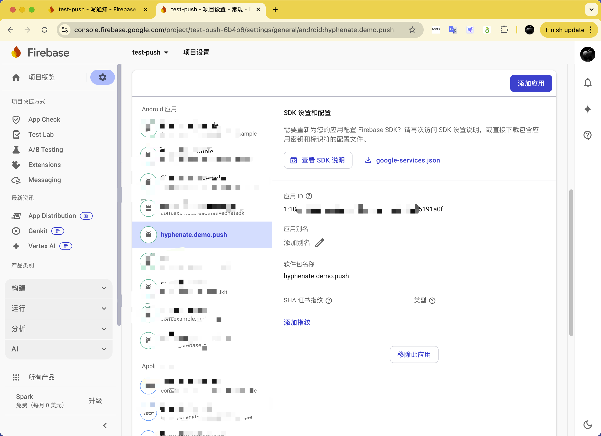

### android 项目配置

修改 app 文件夹下的 build.gradle 文件，添加 fcm 依赖

```gradle
apply plugin: 'com.google.gms.google-services'

// ...

dependencies {
    // fcm config
    implementation 'com.google.firebase:firebase-messaging:24.1.1'
    implementation 'com.google.android.gms:play-services-base:18.6.0'
}
```

### google-services.json

将 `google-services.json` 放在 app 文件夹下。

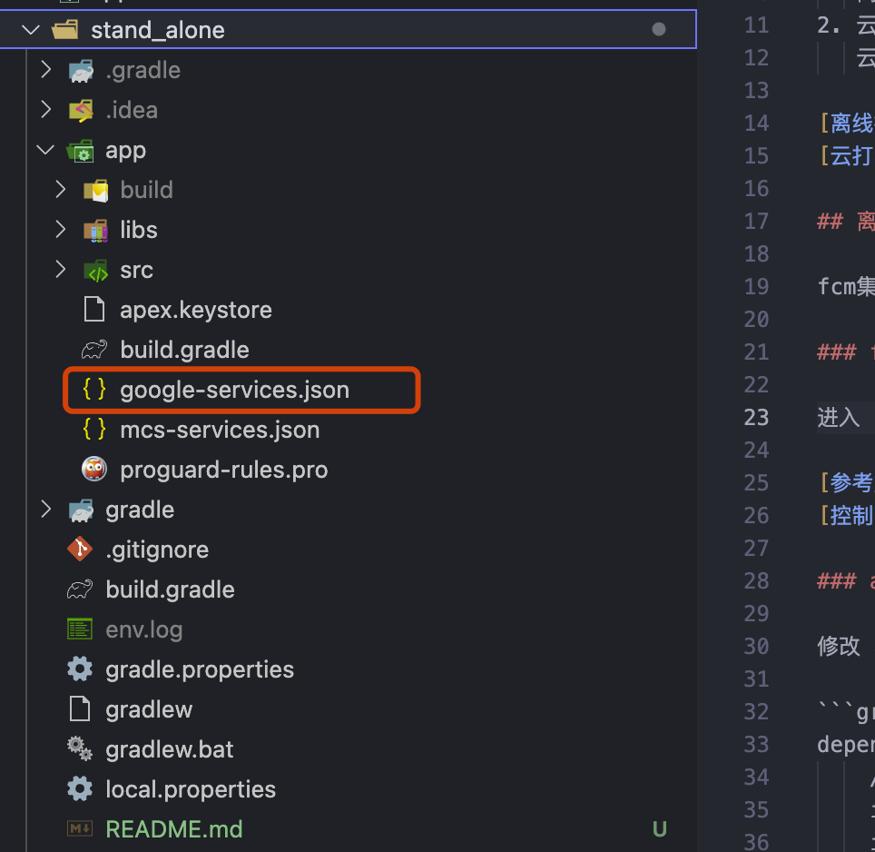

### 打包 app 资源

使用 hbuilder 将 uni-app 打包成 app 资源，放在 `app/src/main/assets/apps` 项目中，通过 android studio 编译运行。

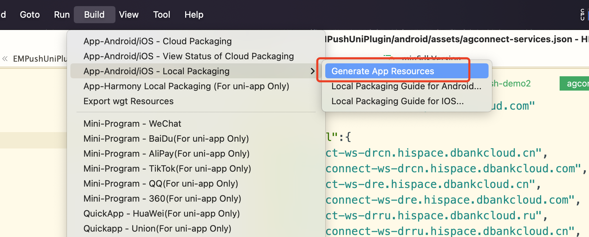

### 配置 app 资源

修改 `app/src/main/assets/data/dcloud_control.xml` 文件，设置 appid 为 上面打包的文件夹的名字。

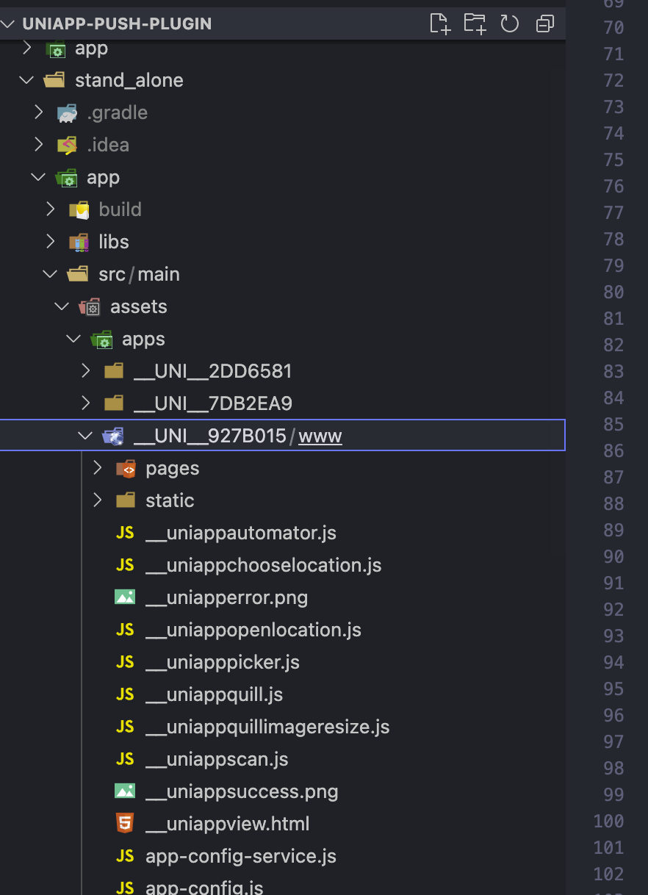

### 配置 dcloud key

修改 `stand_alone/app/src/main/AndroidManifest.xml` 文件，设置 dcloud_appkey 的值。

[appkey 获取](https://nativesupport.dcloud.net.cn/AppDocs/usesdk/appkey.html)

### 编译运行和验证

使用 android studio 打开 项目，安装 应用到移动设备上。

通过 fcm 提供的控制台发送测试消息来验证。

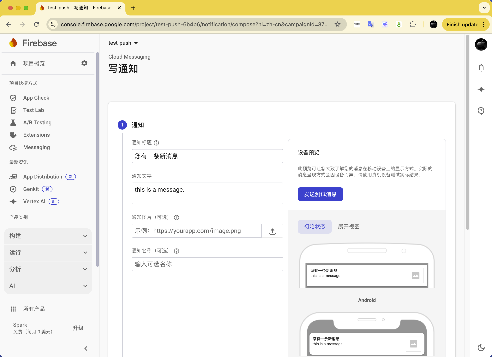

## 云打包

### native aar 配置

android 的依赖通过 aar 的方式引入。放在 `nativeplugins/EMPushUniPlugin` 下面。

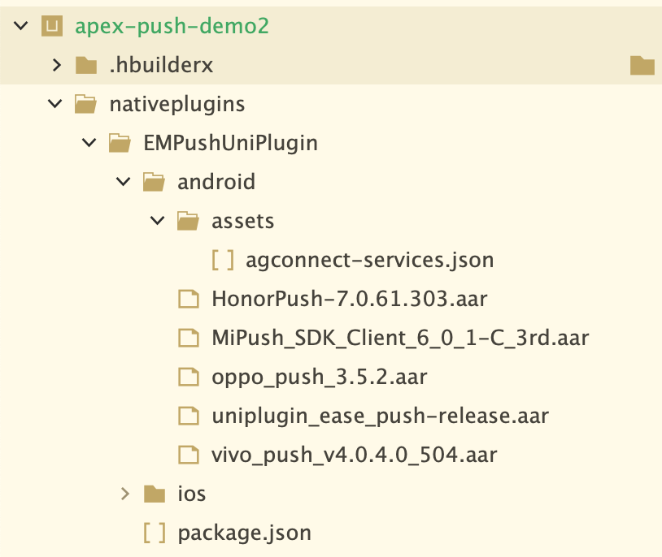

### 权限配置

修改 `manifest.json` 文件内容：

```json
{
  /* 5+App特有相关 */
  "app-plus": {
    /* 应用发布信息 */
    "distribute": {
      /* android打包配置 */
      "android": {
        "permissions": [
          "<uses-permission android:name=\"android.permission.CHANGE_NETWORK_STATE\"/>",
          "<uses-permission android:name=\"android.permission.MOUNT_UNMOUNT_FILESYSTEMS\"/>",
          "<uses-permission android:name=\"android.permission.VIBRATE\"/>",
          "<uses-permission android:name=\"android.permission.READ_LOGS\"/>",
          "<uses-permission android:name=\"android.permission.ACCESS_WIFI_STATE\"/>",
          "<uses-feature android:name=\"android.hardware.camera.autofocus\"/>",
          "<uses-permission android:name=\"android.permission.ACCESS_NETWORK_STATE\"/>",
          "<uses-permission android:name=\"android.permission.CAMERA\"/>",
          "<uses-permission android:name=\"android.permission.GET_ACCOUNTS\"/>",
          "<uses-permission android:name=\"android.permission.READ_PHONE_STATE\"/>",
          "<uses-permission android:name=\"android.permission.CHANGE_WIFI_STATE\"/>",
          "<uses-permission android:name=\"android.permission.WAKE_LOCK\"/>",
          "<uses-permission android:name=\"android.permission.FLASHLIGHT\"/>",
          "<uses-feature android:name=\"android.hardware.camera\"/>",
          "<uses-permission android:name=\"android.permission.WRITE_SETTINGS\"/>"
        ],
        "minSdkVersion": 21
      }
    }
  }
}
```

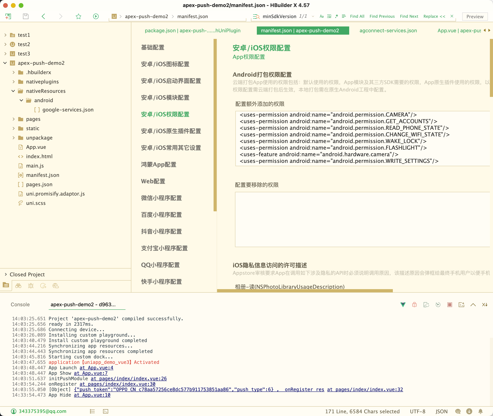

### 推送配置

```json
{
  /* 5+App特有相关 */
  "app-plus": {
    "nativePlugins": {
      "EMPushUniPlugin": {
        "hihonor_app_id": "104459115",
        "oppo_app_key": "0b70d6a74a7148468899c3dca737654a",
        "oppo_app_secret": "d9eaefb90c4b4c8e837e3e30cda6ffb2",
        "com.vivo.push.app_id": "bf9b5941615f32b60ab906966b3b9755",
        "com.vivo.push.api_key": "105792633",
        "xiaomi_app_id": "2882303761520334485",
        "xiaomi_app_key": "5912033445485",
        "meizu_app_id": "154123",
        "meizu_app_key": "3e490dd7c3804f89b4c32d4b67ff1d51",
        "__plugin_info__": {
          "name": "EMPushUniPlugin",
          "description": "环信UNIAPP推送插件",
          "platforms": "Android,iOS",
          "url": "",
          "android_package_name": "",
          "ios_bundle_id": "",
          "isCloud": false,
          "bought": -1,
          "pid": "",
          "parameters": {
            "hihonor_app_id": {
              "des": "荣耀推送 appId",
              "key": "com.hihonor.push.app_id",
              "value": ""
            },
            "oppo_app_key": {
              "des": "OPPO推送 app_key",
              "key": "OPPO_APP_KEY",
              "value": "push_${oppo_app_key}"
            },
            "oppo_app_secret": {
              "des": "OPPO推送 app_secret",
              "key": "OPPO_APP_SECRET",
              "value": "push_${oppo_app_secret}"
            },
            "com.vivo.push.app_id": {
              "des": "VIVO推送 app_id",
              "key": "com.vivo.push.app_id",
              "value": ""
            },
            "com.vivo.push.api_key": {
              "des": "VIVO推送 api_key",
              "key": "com.vivo.push.api_key",
              "value": ""
            },
            "xiaomi_app_id": {
              "des": "XIAOMI推送 app_id",
              "key": "XIAO_MI_APP_ID",
              "value": "push_${xiaomi_app_id}"
            },
            "xiaomi_app_key": {
              "des": "XIAOMI推送 app_key",
              "key": "XIAO_MI_APP_KEY",
              "value": "push_${xiaomi_app_key}"
            },
            "meizu_app_id": {
              "des": "MEIZU推送 app_id",
              "key": "MEI_ZU_APP_ID",
              "value": "push_${meizu_app_id}"
            },
            "meizu_app_key": {
              "des": "MEIZU推送 app_key",
              "key": "MEI_ZU_APP_KEY",
              "value": "push_${meizu_app_key}"
            }
          }
        }
      }
    }
  }
}
```

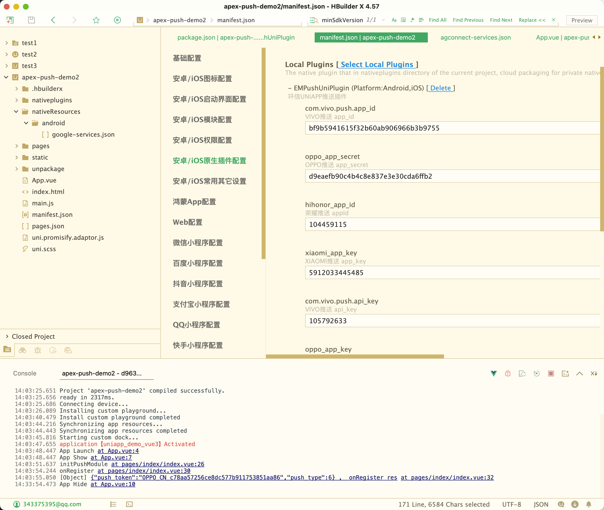

### 移动应用云构建

如果是免费的云构建可能需要排队等待。

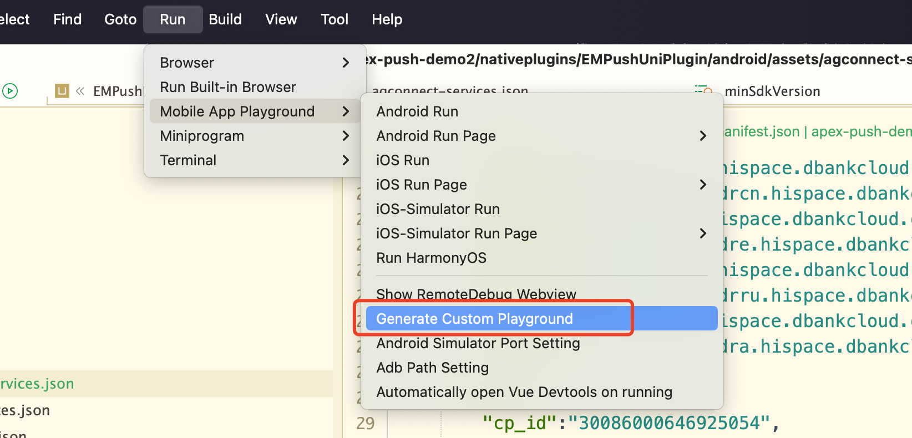

### 安装和运行

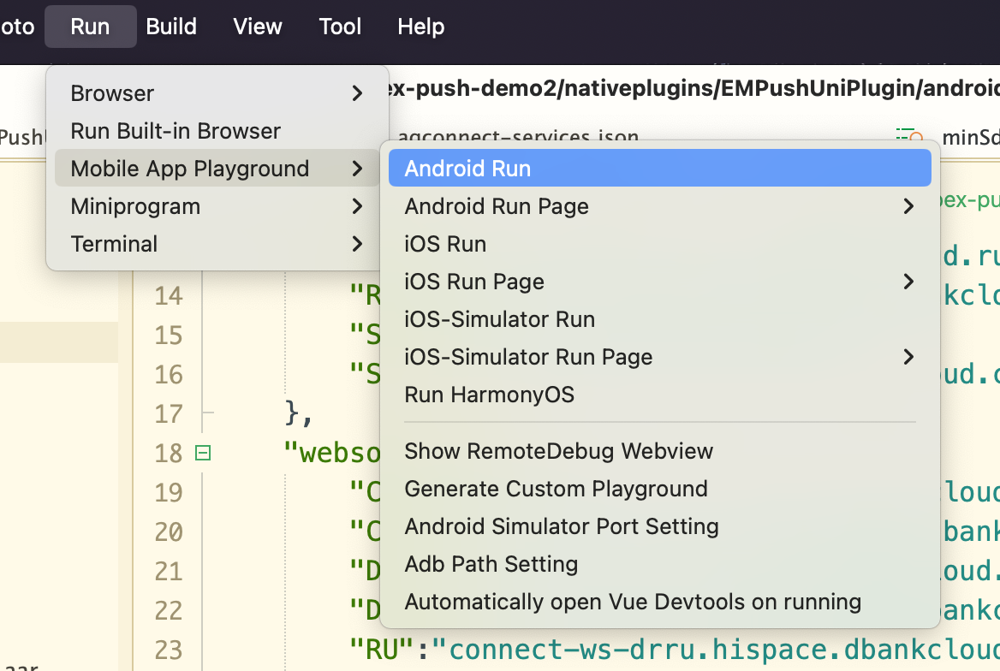
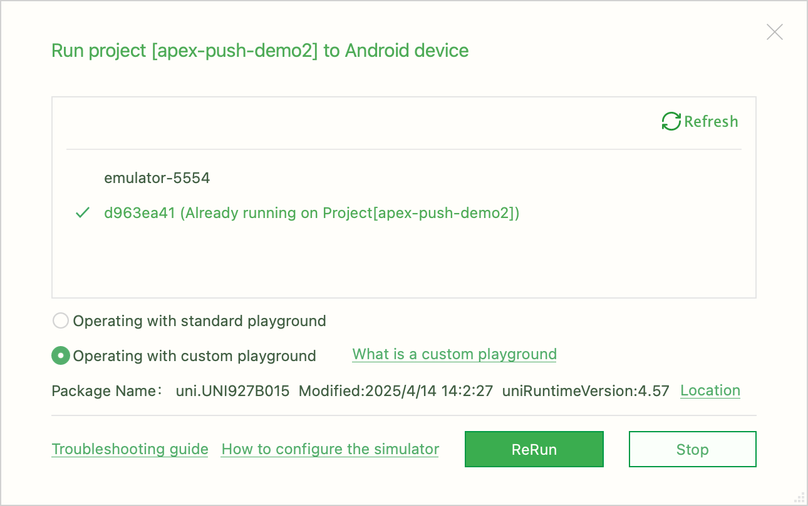
